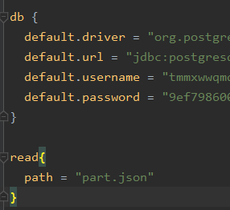

<h3>Test task (Scala)</h3>
<h4>Используемые технологии: Play Framework, Cats, doobie, PostgreSQL</h3>
<h4>Http сервер, предоставляющий апи для работы с дампом wiki quotes</h3>

<h4>Использование:</h2>

Клонировать репозиторий:

<code>git clone https://github.com/vsevolod66rus/wikiquote-test-scala.git</code>

в директории проекта через консоль запустить sbt и проект:

<code>sbt run</code>

(Не обязательно) По дефолту для работы с бд используется heroku-postgresql (с ограничением на число записей), чтобы использовать бд локально, нужно поменять в conf/application.conf значения default.driver, default.url, default.user, default.password

Для теста импорта данных используется файл part.json (1000 строк), чтобы использовать другой json файл, нужно поменять в conf/application.conf значение path

Для тестирования функционала можно использовать postman

<h4>Функционал:</h2>
<ul>
<li>импорт данных цитат википедии (полей create_timestamp, timestamp, language, wiki, category, title, auxiliary_text) из json файла (путь указывается в conf/application.conf)</li>
<li>получить статью в виде json (одной строкой, либо pretty) по title</li>
<li>получить статистику по количеству статей для каждой категории в виде json</li>
<li>редактировать статью</li>
<li>добавить новую статью</li>
</ul>

<h4>API</h2>
<h3>GET /importQuotes</h3>

импорт данных цитат в бд
 

request url:<code>http://localhost:9000/importQuotes</code>

response: text <code>"Started import from file: &lt;tempPath&gt"</code>, либо текст сообщения об ошибке - в зависимости от ошибки

<h3>GET /wiki/&lt;название статьи&gt;</h3>

получить статью в виде json одной строкой
 

request url:<code>http://localhost:9000/wiki/Шахматисты Армении</code>

data: в теле запроса json вида
<pre><code>
    {"id":8,"creationDate":1348106545000,"lastModified":1351171162000,"language":"ru","wiki":"ruwikiquote","category":["Шахматисты по странам","Персоналии:Армения"],"title":"Шахматисты Армении","auxiliaryText":[]}
</code></pre>

, либо текст сообщения об ошибке - в зависимости от ошибки

<h3>GET /wiki/&lt;название статьи&gt;?pretty;</h3>

получить статью в виде pretty json
 

request url:<code>http://localhost:9000/wiki/Шахматисты Армении?pretty</code>

data: в теле запроса json вида
<pre><code>
{
  "id" : 8,
  "creationDate" : 1348106545000,
  "lastModified" : 1351171162000,
  "language" : "ru",
  "wiki" : "ruwikiquote",
  "category" : [ "Шахматисты по странам", "Персоналии:Армения" ],
  "title" : "Шахматисты Армении",
  "auxiliaryText" : [ ]
}</code></pre>

, либо текст сообщения об ошибке - в зависимости от ошибки

<h3>GET /categoriesInfo;</h3>

получить статистику по количеству статей для каждой категории в виде json
 

request url:<code>http://localhost:9000/categoriesInfo</code>

data: в теле запроса json вида
<pre><code>
[{"category":"Викицитатник:Участники Википедии","count":32},{"category":"Телесериалы по годам","count":28}, ...]</code></pre>

, либо текст сообщения об ошибке - в зависимости от ошибки

<h3>POST /addQuote</h3>

Добавить статью
 

request url:<code>http://localhost:9000/addQuote</code>

data: в теле запроса json вида
<pre><code>{
               "language": "kaz",
               "wiki": "ruwikiquote",
               "category": [
                   "Новая Категория"
               ],
               "title": "Новая",
               "auxiliaryText": [
                   "text1",
                   "text2"
               ]
}</code></pre>

response: text <code>"Quote was added"</code> 
либо текст сообщения об ошибке - в зависимости от ошибки

<h3>PUT /changeQuote</h3>

Редактировать статью
 

request url:<code>http://localhost:9000/changeQuote</code>

data: в теле запроса json вида
<pre><code>{
             "id" : 498,
             "creationDate" : 1595159945114,
             "lastModified" : 1595160236337,
             "language" : "ru",
             "wiki" : "ruwikiquote",
             "category" : [ "Новая Категория" ],
             "title" : "Измененная",
             "auxiliaryText" : [ "text1", "text2", "text3" ]
}</code></pre>

response: text <code>"Quote was changed"</code> 
, либо текст сообщения об ошибке - в зависимости от ошибки

 
